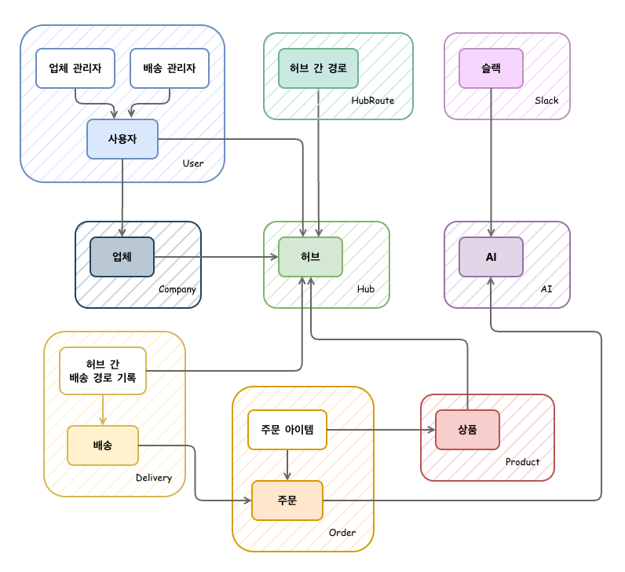
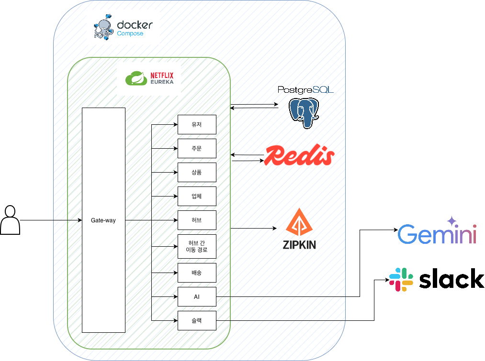

#  Cupeed💘🪽 - 물류 관리 및 배송 시스템


---

## 💖 개요

>이 프로젝트는 **MSA(Microservices Architecture) 기반의 물류 관리 및 배송 시스템**을 구현한 백엔드 애플리케이션입니다.
> 
>Spring Cloud와 Spring Boot를 활용하여 확장 가능하고 유지보수가 용이한 마이크로서비스 아키텍처를 설계하였습니다.

---

## 👑 팀원 소개

✨ **프로젝트 기간** ✨ 2025.11.05 ~ 2025.11.13  
💕 **포지션** 💕 BE 5명

| 💝 역할 | 🎀 이름 | 💫 담당 서비스  |
|:------:|:------:|:----------:|
| 👑 팀장 | **강은선** | 유저, 인증/인가  |
| 💖 팀원 | **김믿음** |   업체, 상품   |
| 💗 팀원 | **이효선** | 배송, 배송담당자  |
| 💓 팀원 | **차초희** | AI, 주문, 슬랙 |
| 💕 팀원 | **황태경** |  허브, 라우트   |

---


## 🌸 개발환경

💻 언어 :   
✨ JDK :   
🎀 프레임워크 :    
💾 DB :    
🐳 Infrastructure :  

💫 ORM : 


---
## 🎀 목차

1. [📄 API 명세서](#-api-명세서)
2. [💿 ERD](#-erd)
3. [🏛️ 아키텍쳐](#️-아키텍쳐)
4. [🎯 MSA 구성](#-msa-구성)
5. [▶️ 실행방법](#️-실행방법)
6. [🛠 기능 요약](#-기능-요약)

---

# 📄 API 명세서

> https://teamsparta.notion.site/29d2dc3ef5148126a0f2fad0ebcfc40e?v=29d2dc3ef51481819d2b000c23580275&pvs=73

---

# 💿 ERD



---

# 🏛️ 아키텍쳐



---

# 🎯 MSA 구성

본 프로젝트는 9개의 마이크로서비스와 3개의 인프라 서비스로 구성되어 있습니다. 💫

## ✨ 인프라 서비스

> 💝 사랑스러운 서비스들을 연결해주는 마법의 인프라에요!

| 🎀 서비스 | 💕 포트 | 💫 설명 |
|:--------:|:------:|:-------|
| **Eureka Server** | `8080` | 서비스 디스커버리 및 레지스트리 |
| **Config Server** | `19090` | 중앙 집중식 설정 관리 |
| **Gateway** | `19091` | API Gateway 및 라우팅 |

## 💖 비즈니스 서비스

> 🌸 각각의 서비스가 하트를 담아 물류를 관리해요!

| 💝 서비스 | 🎀 포트 | 💫 DB 포트 | ✨ 설명                     |
|:--------:|:------:|:---------:|:-------------------------|
| 🤖 **AI Server** | `20010` | `15431:5432` | AI 기반 기능 제공 (Gemini API) |
| 🏢 **Company Server** | `20020` | `15432:5432` | 업체 관리                    |
| 🚚 **Delivery Server** | `20030` | `15433:5432` | 배송 관리                    |
| 🏭 **Hub Server** | `20040` | `15434:5432` | 허브 관리                    |
| 🛣️ **Hub Route Server** | `20050` | `15435:5432` | 허브 간 경로 관리               |
| 📦 **Order Server** | `20060` | `15436:5432` | 주문 관리                    |
| 🛒 **Product Server** | `20070` | `15437:5432` | 상품 관리                    |
| 👤 **User Server** | `20080` | `15438:5432` | 사용자 관리 및 인증              |
| 💬 **Slack Server** | `20090` | `15439:5432` | Slack 알림 연동              |

---

# 🛠 기능 요약

## 💖 핵심 기능

- ✨ **MSA 기반 아키텍쳐**: Spring Cloud를 활용한 마이크로서비스 구성
- 💫 **서비스 디스커버리**: Eureka를 통한 동적 서비스 등록 및 발견
- 🎀 **API Gateway**: 단일 진입점을 통한 라우팅 및 로드 밸런싱
- 💝 **중앙 설정 관리**: Config Server를 통한 통합 설정 관리
- 🏭 **물류 관리**: 허브 기반 물류 시스템 구현
- 🚚 **배송 시스템**: 실시간 배송 추적 및 경로 최적화
- 🤖 **AI 통합**: Gemini API를 활용한 지능형 기능
- 💬 **알림 시스템**: Slack 연동을 통한 실시간 알림
- 💕 **서비스 간 통신**: REST API 기반 마이크로서비스 간 통신
- 💗 **데이터 무결성**: 분산 환경에서의 트랜잭션 관리

## 🌸 기술적 특징

- 🎀 **독립적 배포**: 각 서비스의 독립적인 배포 및 확장
- 💫 **장애 격리**: 한 서비스의 장애가 전체 시스템에 영향을 주지 않도록 설계
- 🐳 **Docker 컨테이너화**: 각 서비스별 독립적인 컨테이너 환경
- 💾 **데이터베이스 분리**: 서비스별 독립적인 PostgreSQL 인스턴스
- 📊 **요청 흐름 모니터링**: Zipkin으로 서비스 간 호출 관계와 지연 구간을 시각화
---

# ▶️ 실행방법

## 🌸 사전 요구사항

- ✨ JDK 17 이상
- 🐳 Docker 및 Docker Compose 설치
- 💝 Git

## 💕 1. 셋팅

### 🌟 1.1. 레포지토리 클론
```bash
git clone <레포지토리 URL>
cd Cupeed
```
### 🌟 1.2. 환경 변수 설정

각 서비스 디렉토리에 `.env` 파일을 생성하고 필요한 환경 변수를 설정해주세요! 💖

```bash
# 각 서비스 디렉토리에서
cp .env
# .env 파일 내용 수정
```

## 💖 2. 인프라 서비스 실행

### 2.1 Eureka Server 실행 ✨
```bash
cd eureka
docker-compose up -d
./gradlew bootRun
```

### 2.2 Config Server 실행 🎀
```bash
cd config
docker-compose up -d
./gradlew bootRun
```

### 2.3 Gateway 실행 💫
```bash
cd gateway
docker-compose up -d
./gradlew bootRun
```

## 🌟 3. 비즈니스 서비스 실행

각 마이크로서비스는 독립적으로 실행됩니다. 필요한 서비스 디렉토리로 이동하여 다음 명령어를 실행하세요! 💝

### 예시: AI Server 실행 🤖
```bash
cd com.sparta.cupeed.ai
docker-compose up -d
./gradlew bootRun
```

### 💖 모든 서비스 실행 순서 (권장)
1. 💫 Eureka Server (8080)
2. 🎀 Config Server (19090)
3. ✨ Gateway (19091)
4. 👤 User Server (20080) - 인증/권한 관리
5. 💕 나머지 비즈니스 서비스들 (순서 무관)

## 🌸 4. 서비스 상태 확인

- 💝 Eureka Dashboard: http://localhost:8080
- 🎀 Gateway: http://localhost:19091

## 💫 5. API 테스트

- ✨ 모든 API는 Gateway(19091)를 통해 접근
- 💖 Postman 또는 Swagger를 통해 테스트

### API 엔드포인트 예시 💕
```
http://localhost:19091/v1/users      # User Service 👤
http://localhost:19091/v1/orders     # Order Service 📦
http://localhost:19091/v1/products   # Product Service 🛒
```

### 🎀 서비스 간 내부 통신 (FeignClient)
마이크로서비스 간 통신 시 FeignClient를 사용하며, `/internal` 경로를 통해 내부 API를 호출해요! 💝

```java
// 예시: User Service를 호출하는 FeignClient
@FeignClient(name = "user-service")
public interface UserClient {
    @GetMapping("/internal/users/{userId}")
    UserResponse getUser(@PathVariable Long userId);
}
```

내부 API 엔드포인트 구조:
```
http://localhost:20080/internal/users/{userId}      # User Service 내부 API
http://localhost:20070/internal/products/{id}       # Product Service 내부 API
http://localhost:20060/internal/orders/{orderId}    # Order Service 내부 API
```

💫 `/internal` 경로는 서비스 간 통신 전용이며, Gateway를 통한 외부 접근은 제한되어 있어요!


## 🌟 6. 서비스 종료

각 서비스 디렉토리에서 Docker Compose 종료:
```bash
docker-compose down
```


